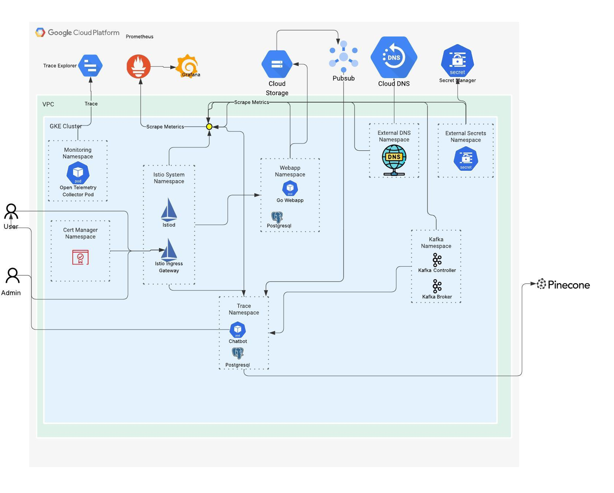
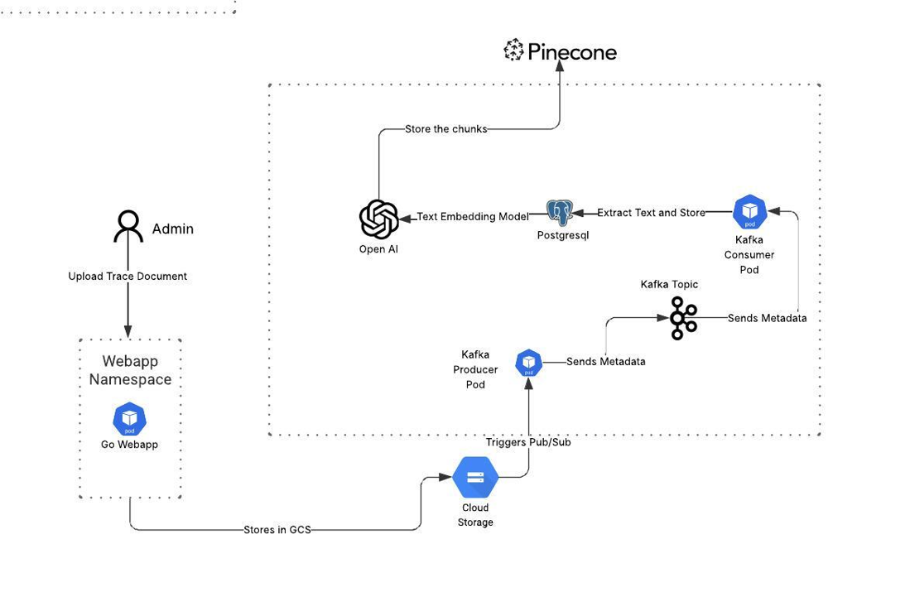

# Trace Survey Feedback Bot

Welcome to the **Trace Survey Feedback Bot** project!

This project consists of **11 repositories**, each addressing a specific component or functionality of the overall system.

While each repository includes its own `README.md` with detailed information relevant to that part, **this document provides an overarching view of the entire project** and how the pieces fit together.

> 🔗 Please refer to the individual repositories for in-depth documentation and technical specifics.

## 📌 Project Overview

# 📌 TRACE Survey Feedback Bot - Project Overview

The **Trace Survey Feedback Bot** is an intelligent chatbot powered by a **Retrieval-Augmented Generation (RAG)** architecture designed to help users query and explore university course feedback from **TRACE surveys** (the official feedback system used by the university).

## 🎯 What Users Can Do

Users can interact with the bot using natural language questions such as:

- _"How is Professor X in general?"_
- _"What do students feel about Professor X during Spring 2025?"_
- _"Which courses have the highest ratings this semester?"_
- _"What are common complaints about Course Y?"_

The chatbot retrieves relevant feedback data and returns summarized insights based on TRACE survey responses, helping users make informed decisions about courses and instructors.

## 🏗️ System Architecture

### Core Infrastructure (Google Cloud Platform)

- **GKE Cluster**: Hosts the main application components within a VPC
- **Monitoring**: Comprehensive observability with Prometheus, Grafana, and Open Telemetry
- **Secret Management**: Secure credential handling via Google Secret Manager
- **DNS & Networking**: Cloud DNS with Pub/Sub messaging integration

### Data Processing Pipeline

1. **Document Ingestion**: Admins upload TRACE survey documents through a web interface
2. **Text Processing**: OpenAI's text embedding model extracts and processes survey content
3. **Vector Storage**: Processed embeddings are stored in PostgreSQL for efficient retrieval
4. **Real-time Updates**: Kafka handles event streaming and data synchronization

### RAG Implementation

- **Query Processing**: User questions undergo chain-of-thought prompting via OpenAI
- **Vector Search**: The system converts user queries to embeddings and searches the PostgreSQL vector database
- **Context Retrieval**: Relevant TRACE survey chunks are retrieved using similarity matching
- **Response Generation**: OpenAI generates contextual answers based on retrieved survey data
- **External Integration**: Results can be stored in Pinecone for enhanced vector search capabilities

### Supporting Services

- **Istio Service Mesh**: Traffic management and security within the cluster
- **External DNS**: Automated DNS record management
- **Kafka Ecosystem**: Event streaming with dedicated controller and broker pods

## 🔧 Technology Stack

- **Frontend**: Streamlit application for user interactions
- **AI/ML**: OpenAI models for embeddings and text generation
- **Database**: PostgreSQL with vector search capabilities
- **Vector Store**: Pinecone for scalable similarity search
- **Message Streaming**: Apache Kafka
- **Orchestration**: Kubernetes (GKE)
- **Monitoring**: Prometheus + Grafana + OpenTelemetry
- **Infrastructure**: Google Cloud Platform

## The chatbot retrieves relevant feedback data and returns summarized insights based on TRACE survey responses, helping users make informed decisions about courses or instructors.

## 📐 Overall Architecture & RAG Flow

Below is the overall architecture diagram and the diagrams explaining how the RAG model works:

### 🏗️ Overall Architecture

### 🧠 How the RAG Model Works

### 🔧 Admin Workflow (Data Upload + Processing)

---

## 🚀 Deployment

The entire application is deployed on **Google Kubernetes Engine (GKE)** with:

- A registered **domain name**
- **HTTPS** support
- **Public accessibility** like a production-grade website
- Proper **load balancing** and **traffic management**

More details on the backend architecture and deployment setup will be provided in later sections.

---

## ⚠️ Manual Setup Required

### DNS Configuration

- [ ] **Buy a domain name** for the application
- [ ] **Set up NS records** for the domain name
- [ ] **Create hosted zone in Route53** for DNS management
- [ ] **Create subdomain hosted zones in Route53** for development and production environments:
  - [ ] `dev.domain.com` for development environment
  - [ ] `prd.domain.com` for production environment

---

## 📦 Repository Breakdown

### `trace-ami-jenkins/`

This repository is responsible for building a custom Amazon Machine Image (AMI) for Jenkins using **Packer**, with the process automated via **GitHub Actions**.

Key components include:

- **Packer configuration** to define the Jenkins AMI build process.
- A **shell script** that:

  - Installs required system dependencies
  - Installs Jenkins
  - Configures necessary Jenkins plugins used by this project
  - Adds predefined Jenkins pipelines tailored for this setup

- Two **GitHub Actions workflows**:
  - **CI Workflow** – Validates and formats Packer templates on pull requests.
  - **Build Workflow** – Builds and packages the AMI on pushes to `main`, using Packer and secure secrets handling via SOPS and GitHub Secrets.

The AMI built from this setup is used to spin up Jenkins instances with everything pre-configured for this project's CI/CD needs.

### `trace-infra-jenkins/`

This repository contains **Terraform configurations** to provision Jenkins infrastructure on **AWS**.

Key functionality includes:

- Provisions a Jenkins EC2 instance.
- Associates a manually created **Elastic IP** with the instance via its name.
- Creates an **A record in Route 53** pointing to the instance, using manually created DNS zones.
- Designed to be modular and reusable across environments.

This setup allows for easy provisioning and teardown of Jenkins infrastructure using Terraform commands like `init`, `plan`, `apply`, and `destroy`.

### `tf-infra-gcp/`

This repository manages the **GCP infrastructure setup** using **Terraform** for both development (`dev`) and production (`prd`) environments.

- Provisions core infrastructure across multiple GCP projects (`gcp-project-dev`, `gcp-project-prd`, and `gcp-project-dns`).
- Uses a modular structure with shared Terraform modules (e.g., VPC, GKE, GCS, bastion, CMEK, secret manager, pubsub).
- Supports repeatable deployments with isolated environments for testing (`dev`) and production (`prd`).

This setup lays the foundation for deploying the Trace Survey Feedback Bot on GKE.

### `trace-api-db/`

This repository contains the **Liquibase** scripts and database schema definitions to manage the backend database for the Trace Survey Feedback Bot.

- Defines the schema and tables for storing professor details, subjects taught, semesters, and the locations of Trace surveys (hosted in GCP).
- The actual survey PDFs are stored separately in Google Cloud Storage (GCS).
- Includes a **Dockerfile** to containerize the database setup.

### CI/CD Pipelines

There are two Jenkins pipelines configured via `Jenkinsfile`s:

1. **Commit Message Validation Pipeline**  
   Validates commit messages using `commitlint` to enforce conventional commit standards.

2. **Build and Push Docker Image Pipeline**
   - Triggered on GitHub pushes.
   - Builds a multi-architecture Docker image using Docker Buildx for both `amd64` and `arm64` platforms.
   - Tags the image using semantic-release to automatically determine versioning.
   - Pushes the built image to Docker Hub using stored credentials.

This setup ensures reliable versioning, automated builds, and consistent database schema deployment.

### `trace-api-server/`

This repository contains the **Go-based microservice** providing APIs exclusively for the **application admin** to manage professor and survey details for the Trace Survey Feedback Bot.

Key points:

- Implements RESTful APIs used **only by admins** to add or modify professor and survey data.
- End users do **not** interact with this service directly.
- Supports authentication, request validation, and error handling.
- Containerized using Docker for consistent deployment.
- Integrates CI/CD with two Jenkins pipelines:
  1. Commit message validation pipeline enforcing conventional commits.
  2. Build and push Docker image pipeline with semantic versioning.

Built with Go, designed for performance, reliability, and maintainability.

### `trace-rag-db/`

This repository contains Liquibase changelog scripts for setting up the database schema required by the RAG (Retrieval-Augmented Generation) application.

Key points:

- Creates a dedicated `trace` schema in the database.
- Defines tables to store documents, course information, course ratings, and student comments.
- Establishes foreign key relationships linking course info, ratings, and comments back to documents.
- Adds indexes to optimize search and retrieval based on document name and instructor name.
- The database structure supports storing and querying survey data for RAG-based feedback.

This database will be used by the RAG application, which will be explained in the upcoming sections.

Like other repos, it includes two Jenkins pipelines for commit message validation and Docker image build and push.

### `trace-rag-pubsub/`

This repository contains a Python service acting as a **bridge between Google Cloud Pub/Sub and Apache Kafka**. It specifically listens for GCS (Google Cloud Storage) PDF upload events via Pub/Sub and forwards those events to Kafka topics for further processing.

Key points:

- Subscribes to Pub/Sub notifications triggered by GCS file uploads.
- Filters messages to process **only PDF files**.
- Transforms Pub/Sub messages into Kafka-compatible JSON format.
- Produces messages to Kafka topics for downstream consumption.
- Includes heartbeat logging and robust error handling for reliable operation.
- Containerized with a Dockerfile and automated deployment using Jenkins pipelines.
- Relies on Pub/Sub notifications set up via Terraform.
- When admins upload PDFs to GCS, the service detects the event and pushes relevant details to Kafka.

Kafka integration details will be explained later during the Kafka setup description.

### `trace-rag-consumer/`

This repository contains a Kafka consumer microservice responsible for processing PDF upload events for the Trace Survey Feedback Bot.

Key points:

- Listens to Kafka messages produced by the Pub/Sub to Kafka bridge service.
- Downloads PDF files from Google Cloud Storage.
- Extracts text content from PDFs.
- Stores metadata and processed data in PostgreSQL (schema created by `trace-rag-db`).
- Creates vector embeddings from extracted text chunks using Pinecone.
- Uploads these embeddings to Pinecone to enable efficient semantic search as part of the RAG functionality.
- Includes error handling and detailed logging for reliability.
- Containerized with a Dockerfile.
- CI/CD pipeline included via Jenkins for automated Docker image build and push.

This service is a key part of the RAG pipeline, converting raw PDFs into searchable vectors to power user queries.

### `trace-rag-processor/`

# RAG API Service

A FastAPI-based REST API service providing Retrieval-Augmented Generation (RAG) functionality for querying professor information using conversational AI with memory and context awareness.

## Overview

This service exposes HTTP endpoints to enable interactive Q&A about professors. It integrates with the RAG pipeline, combining document retrieval from vector databases (using Pinecone for vector search) with AI-generated responses. The service maintains conversation history to provide contextual, professor-specific answers.

The API connects to PostgreSQL for professor data and Pinecone for efficient vector similarity search, enabling rich, context-aware feedback responses.

## Features

- RAG pipeline combining retrieval with generation, backed by Pinecone vector search
- Conversation memory for context-aware interactions
- Professor filtering and data retrieval from PostgreSQL
- CORS support for frontend integration
- Containerized with Dockerfile
- CI/CD Jenkins pipeline for automated builds and deployment

## Example API Endpoints

- `POST /rag/ask`: Accepts a question, conversation history, and professor name; returns a contextual answer and summary.
- `GET /professors`: Returns a list of distinct professor names from the database.

This API service acts as the backend for the frontend chatbot interface.

### `trace-frontend_chatbot/`

This repository contains the Streamlit-based frontend for the chatbot interface that interacts with users querying TRACE survey data about professors.

Key points:

- Provides a clean, interactive chat UI for users to ask questions.
- Dropdown selector for choosing a specific professor.
- Maintains conversational memory to allow for context-aware responses.
- Connects to the RAG API (`trace-rag-processor`) to get intelligent answers.
- Displays optional context summaries ("memory") used to generate responses.
- Supports local development as well as containerized deployment using Docker.

Like other repos, it includes two Jenkins pipelines for commit message validation and Docker image build and push.

### `trace-helm-charts/`

This repository contains Helm charts for deploying the entire Trace Survey feedback system on a GKE cluster.

Key points:

- Deploys all components of the Trace feedback system via Helm.
- Includes subcharts for:
  - The Go-based user interaction API
  - External Secrets for managing sensitive data
  - cert-manager for HTTPS certificates
  - Kafka for event-driven messaging
  - OpenTelemetry for observability
  - External DNS integration with GCP Cloud DNS
  - The RAG-based application backend
- Supports deployment on GKE with Workload Identity, Istio, and Cloud DNS.
- Charts are modular, enabling fine-grained control over each component’s deployment.

This setup allows full-stack deployment of the Trace system with HTTPS, DNS, logging, and monitoring configured out of the box.
